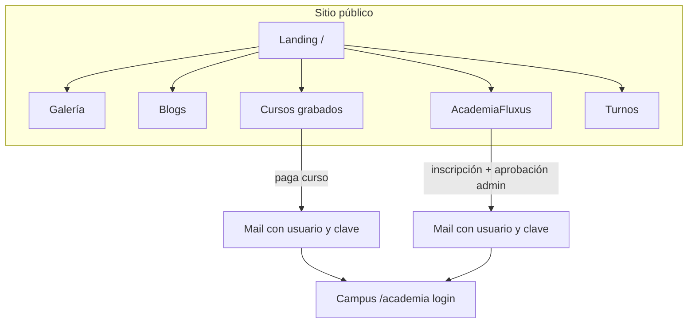
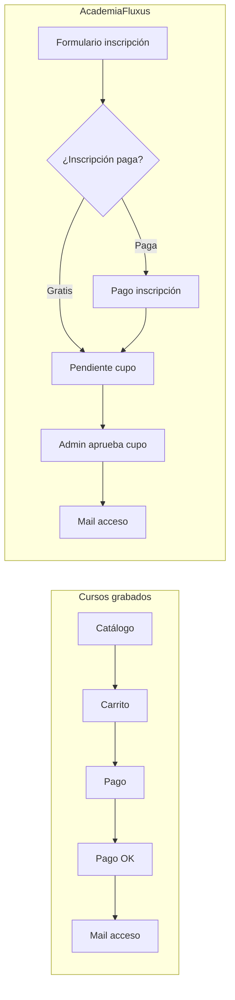
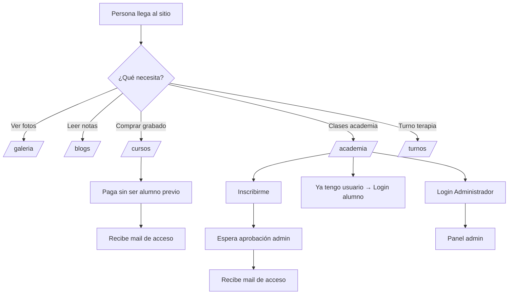
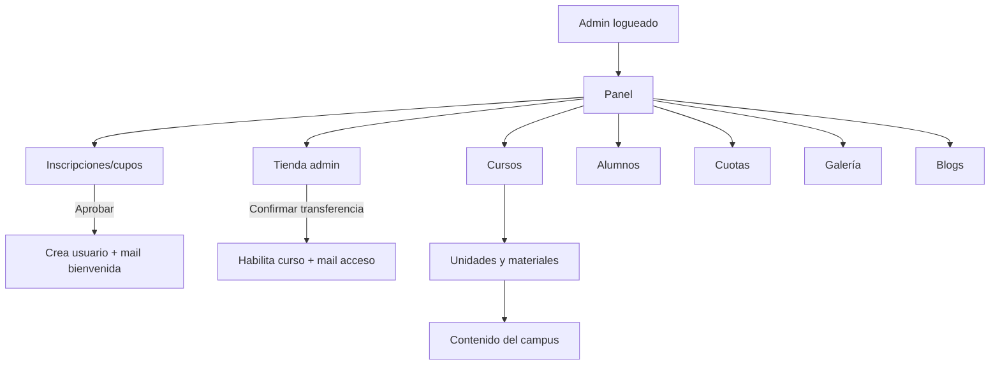

# FluxusTerapia · Flujo de la aplicación web

Guía para administradores: cómo está armado el sitio y qué hace cada parte.

**Sitio:** https://www.fluxusterapia.com  
**Última actualización:** septiembre 2026

---

## 1. Vista general

El sitio es un solo hosting (HostGator) con varias secciones independientes que comparten el mismo dominio:

| Sección | URL | Para qué sirve |
|---------|-----|----------------|
| Landing | `/` | Presentación FluxusTerapia |
| Galería | `/galeria/` | Fotos y videos del consultorio |
| Blogs | `/blogs/` | Notas, papers, PDFs |
| **Cursos grabados** | `/cursos/` | Comprar cursos grabados (pago → mail de acceso) |
| **AcademiaFluxus** | `/academia/` | Campus en vivo, inscripción, cuotas |
| Turnos | `/turnos/` | Reserva de turnos + seña |



---

## 2. Dos productos de aprendizaje (importante)

Están **separados a propósito**:

### A) Cursos grabados → `/cursos/`
- Cualquiera ve el catálogo y compra.
- Paga por transferencia o Mercado Pago.
- Al confirmar el pago se envía mail con **usuario, contraseña y link**.
- Entra al campus (`/academia/login.php`) solo a los cursos que compró.
- **No** pasa por aprobación de cupo.

### B) AcademiaFluxus (en vivo / campus) → `/academia/`
- El alumno se **inscribe** en `/academia/inscripcion.php`.
- Inscripción **gratis o paga** (lo define el admin).
- El admin recibe aviso y **aprueba el cupo**.
- Recién ahí se envía el mail de acceso.
- Después puede haber **cuotas mensuales**.



---

## 3. Quién entra cómo



**Login administrador:**  
https://www.fluxusterapia.com/academia/login.php?as=admin

Con ese login también podés editar **Galería** y **Blogs** (misma sesión de admin del sitio).

---

## 4. Panel del administrador (Academia)

Tras entrar como admin vas al panel:

| Menú | Función |
|------|---------|
| Gestionar alumnos | Altas, bajas, cursos asignados, claves |
| Inscripciones / cupos | Aprobar o rechazar pedidos de academia |
| Cursos y clases | Crear/editar/dar de baja cursos |
| Unidades y materiales | Subir PDFs, videos, contenidos por unidad |
| Tienda (admin) | Precios de cursos grabados + confirmar transferencias |
| Cuotas y pagos | Alias CBU, cuotas mensuales, monto inscripción |
| Administradores | Crear otros admins |
| Editar galería | Fotos/videos del sitio |
| Editar blogs | Publicar y editar notas |



---

## 5. Flujo detallado: inscripción Academia

1. Alumno abre `/academia/inscripcion.php`.
2. Completa nombre, email, curso de interés.
3. Si el monto de inscripción es **0** → queda pendiente de cupo.
4. Si hay **monto** → paga (transferencia o Mercado Pago) y después queda pendiente de cupo.
5. El admin recibe mail de aviso.
6. Admin → **Inscripciones / cupos** → **Aprobar cupo y enviar acceso**.
7. El sistema crea la cuenta y manda mail con usuario, contraseña y link al campus.

**Configurar monto:** Admin → Inscripciones / cupos → “Monto inscripción (0 = gratuita)”.

---

## 6. Flujo detallado: compra curso grabado

1. Visitante abre `/cursos/`.
2. Agrega cursos al carrito y paga.
3. **Mercado Pago aprobado** → acceso automático + mail.  
   **Transferencia** → admin confirma en **Tienda** → ahí se habilita y se manda el mail.
4. El alumno entra a `/academia/login.php?as=alumno` con esos datos.

Los contenidos del curso se cargan una sola vez en **Unidades y materiales**; sirven para academia y para grabados.

---

## 7. Mapa de carpetas (técnico, resumido)

```
public_html/
├── index.html              → Landing
├── galeria/                → Galería pública + admin.php
├── blogs/                  → Blog público + admin.php
├── cursos/                 → Tienda de cursos grabados
├── academia/               → Campus + inscripción + panel admin
│   ├── admin/              → Panel (alumnos, cupos, cursos, tienda…)
│   ├── inscripcion.php     → Pedido de cupo
│   ├── data/               → Base SQLite (no subir a git)
│   └── includes/           → Pagos, mails, shop, inscripciones
├── turnos/                 → Agenda + seña
└── includes/site_admin.php → Sesión admin compartida (galería/blogs)
```

**Deploy:** desde la carpeta del proyecto, `python3 deploy.py` sube `public_html/` por FTP.

---

## 8. Checklist rápido para un admin nuevo

1. Entrá por **Administrador** en AcademiaFluxus.
2. Revisá **Inscripciones / cupos** (aprobar gente nueva de la academia).
3. Revisá **Tienda** (confirmar transferencias de cursos grabados).
4. Cargá contenidos en **Unidades y materiales**.
5. Publicá precios de grabados en **Tienda**.
6. Editá **Galería** y **Blogs** cuando haga falta.
7. En **Cuotas**, mantené alias/CBU y montos al día.

---

## 9. Contactos / datos de pago

- Los datos de transferencia (alias, titular, banco) se editan en **Admin → Cuotas y pagos**.
- El mail de avisos de cupo se configura en **Inscripciones / cupos**.
- Correo del sitio (típico): `hola@fluxusterapia.com`

---

*Documento interno FluxusTerapia · para compartir con futuros administradores.*
